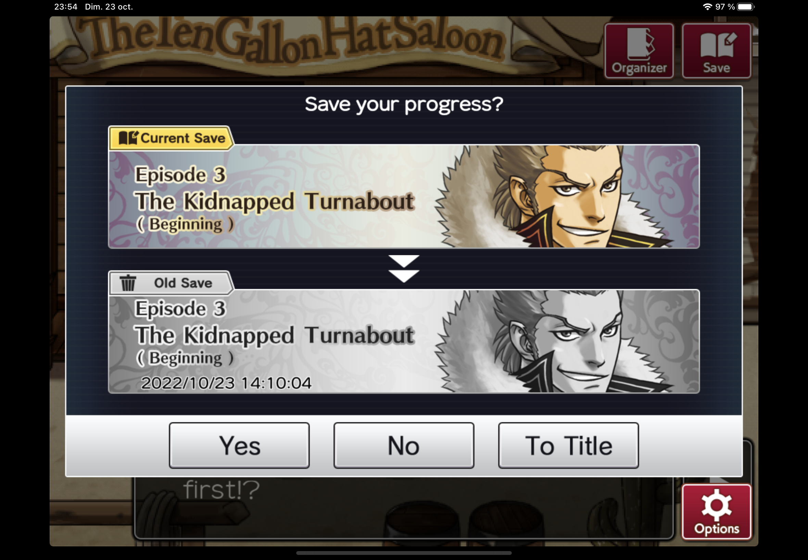

# Backup in video games

I started to work on the backup in video games because I thought it's nowadays a
common system in this industry but it hasn't always been the case and it changes
the narration drastically.

## What is a backup?

These are data contained in a computer system to preserve them. It could be an hard disk, an extern hard disk, an usb key, cartridges etc.

You can export-import them between differents computer systems, these are like "packages".

## Perception of time while we are playing

When we play a video game, we enter a specific environment with their rules and limits.
To be able to play, we must submit to it and the story begins within this preconceived sphere. It can range from a simple experiment of a few minutes to entire days devoted to finalizing this game.
For the secon option, the norm is to use a backup system, it allows players to have pause and progress how they wants, so they're not stressed about the state of their games and it's a comfort.

Backup is a system which gives the main control of the environment to the gamers.
To my mind it's reassuring for two reasons:

1/ It allows you to keep the dominant position on your machine, you are the one who can control it, the game has their on environment and rules but it's only in the machine and it doesn't affect you in reality.

2/ Backup is a memory system so it's indeed a trace. It shows you what you did for hours and hours, even more if you can see the number of hours of play spent on it. So you can prove what you did all this time.

For the 2/, sometines you don't see the time pass while you are playing and after 4 hours of game you are like "omg did I do this all the time" and the backup is a piece to link your time passed in a virtual world to reality.

## Backup as reversible time

A practice you can have when you play video games is to do some severals backup while you are playing, in case you find yourself in a dead end (game with choices for exemple) and you want to go back to not be confronted with this situation.
Even if you have only one backup, if you are losing in a confrontation, you can restart your backup to avoid the fact you are losing (ex: in front a boss) without actually lose all what you did in this game.

Picture from Ace Attorney INVESTIGATIONS

Here is the latest exemple of one of my games, you can see the menu of backup with "YES", "NO", "TO TITLE". The last one, allows me to easily return to the starting screen and reload my latest backup, to avoid the situation where I am losing or when I'm doing some mistakes.

So that's what I mean by reversible. Backup provides to us a lot of different temporality in the same system, and so a diversity of temporality.

 Here is the tracker I made about me on two days, while I'm playing on this game.

## Can we rethink the backup?

Can we picture a gesture/an idea/ an object about the no-backup? An experience which can reinterpret the data memory? Make it less comfortable?

Picture from Animal Crossing Wild World
I remembered a bad experience of backup from my childhood with Resetti from AC Wild World. It was a mole that came to lecture you if you forgot to save your game properly. It was particulary long each time, and if you smashed the A button to skip the dialog, he noticed it and told it. I know this mole wasn't a good time for everyone who played this game.

I imagine an experience which consists to do several backups, and to return to these but each time you return, each time it would change the content of the backup. So everything will be disorganized.

1st draw idea/prototype

The main idea I want to communicate if I would to keep this subject is to communicate and question this as a norm which means, doing a project without usuable backups will be disturbing for the users and reput in context the fact that: it's not a given. It could change and so: how can we adapt if a norm comes to no longer be one?

## Bibliography

https://fr.wikipedia.org/wiki/Sauvegarde_(jeu_vid%C3%A9o)

https://www.researchgate.net/publication/281632384_Espaces_et_temps_des_jeux_video

