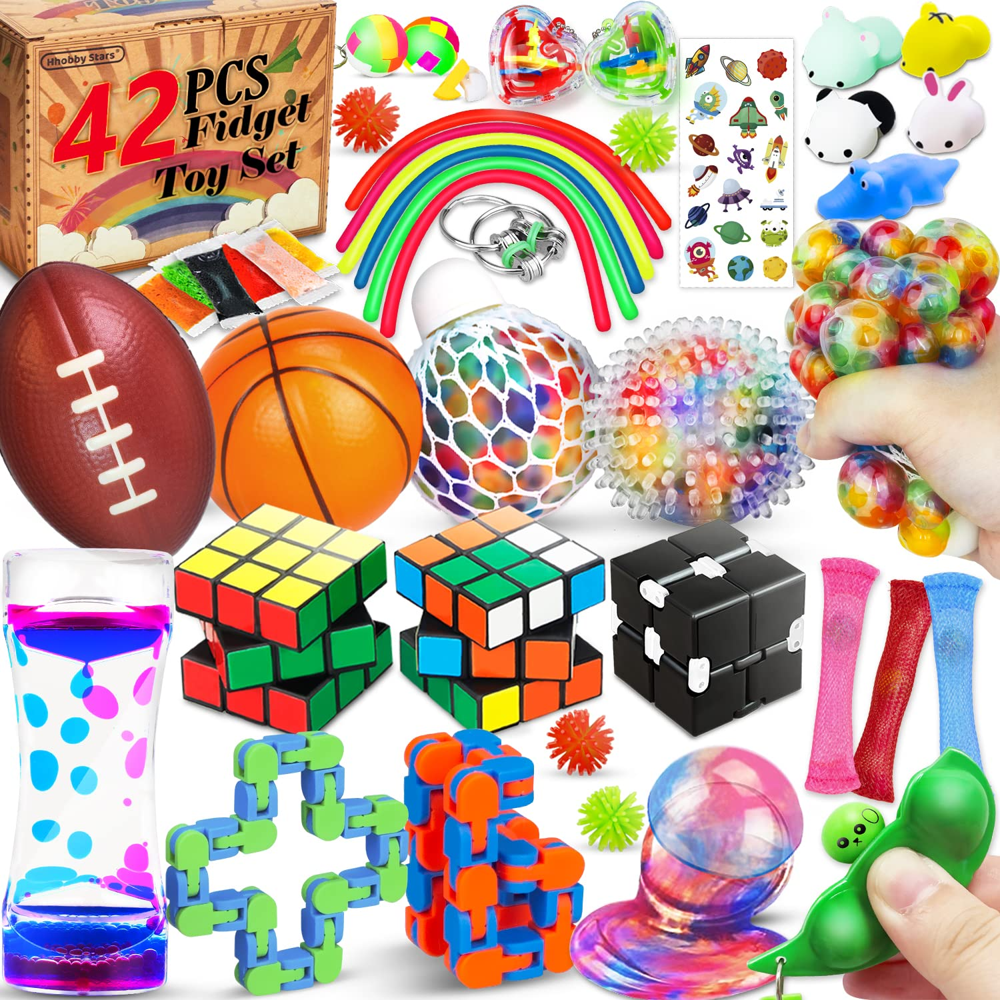
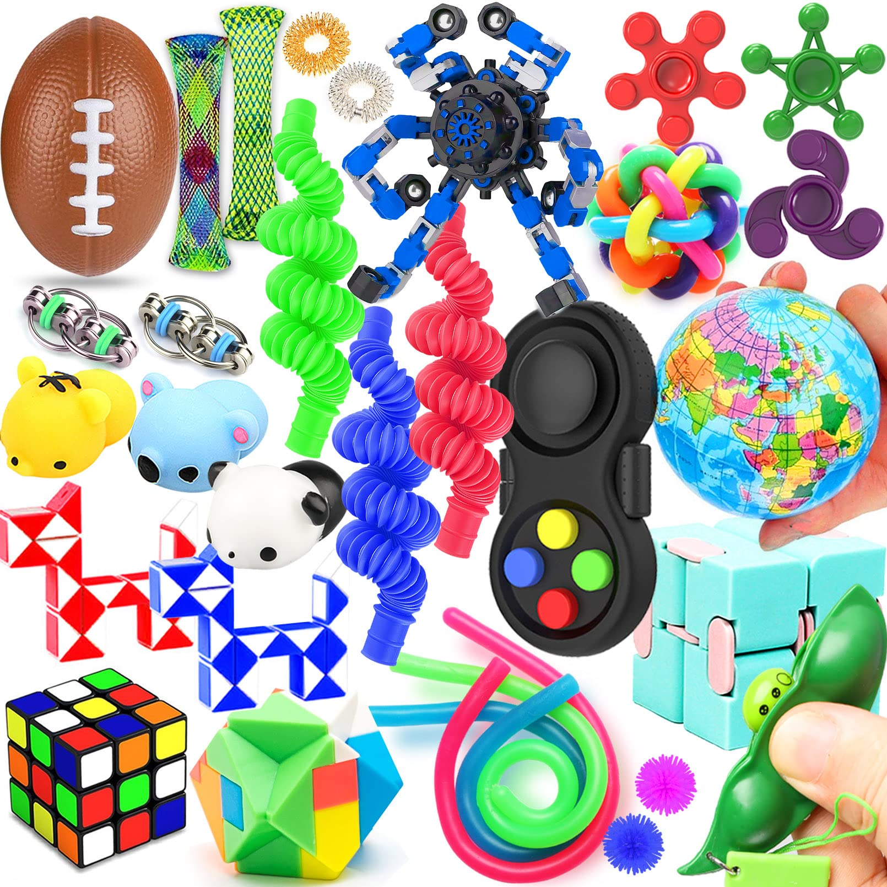

Quelques exemples ici de stim toys, qui sont des objets sensoriels qui m'inspirent pour ce que je souhaiterais faire de l'ensemble de mon fossile.

Je souhaiterais rendre un côté stimulant par le toucher à mob objet, puisqu'il est à la fois une allégorie du corps mais aussi une forme d'outil destiné à permettre de se "refocus" en cas d'angoisse ou autre.

