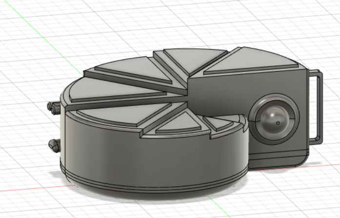
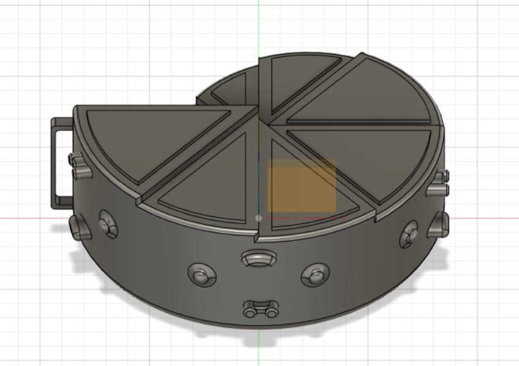
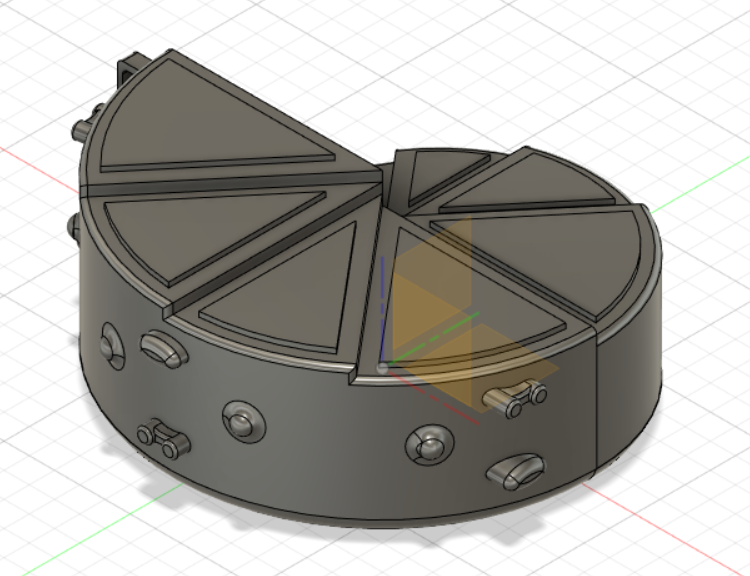

1-Shell Base: Diameter big semi circle: 85mm;
Diameter smaller circle: 62.50mm;

2-Extrusion basic stair shape: Lowest: 20.00mm;
Highest: 34.00mm;
8 steps in the stair of the shell + 2mm; + on each step a new 1mm smaller triangle, reduce the width on 3mm on each sides (esquisse);

3-Inside the object: Lowest part of the fossil:
Extrusion to lock it: 2mm;
Place to lock vibration sensor: 3.50mm height + 13mm width (12mm with nothing and full 1mm);
Highest part of the fossil:
Extrusion to lock it: 2mm;

4-Shapes along the outer coast of the fossil:
Notch to put the strap:
Length: 25mm; Width: 3mm; Height: 5mm; Empty to: 22.50*4*3mm;

Big wavy button:
1 full circle: 10mm diameter + Extrusion: 5mm;
1st bigger circle: 13 mm diameter + Extrusion:3mm;
2sd bigger circle: 14mm diameter + extrusion:2mm,

Pattern motif:
Circle: Width 4mm;
Extrusion: a) Notch side: between 3-4mm, b&c)Center side + opposite from notch 3mm;

Oval: Width, Length: 8*4mm;
Extrusion: a+b) 3mm, c) 5mm;

2 circles linked by  2 arcs: Each circles: 3.00, their centers are linked by 5mm;
Extrusion: a+b) Circles: 3mm + arcs: 2mm, c) circles: 5mm + arcs: 4mm

