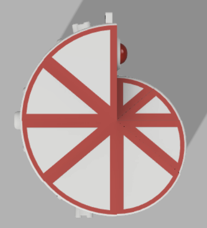
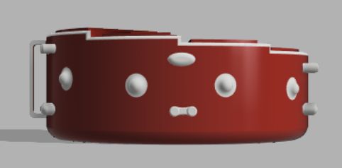
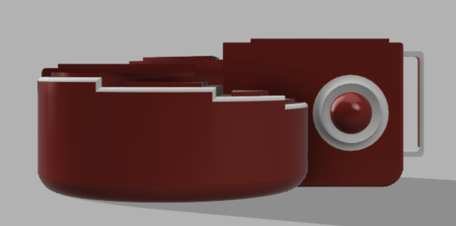
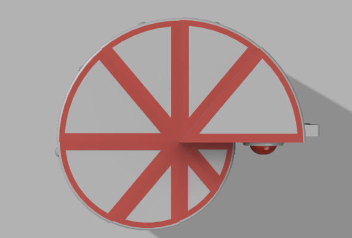
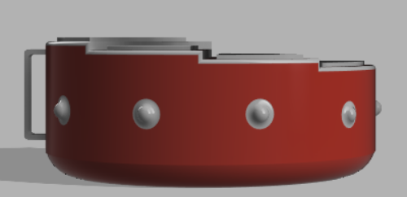
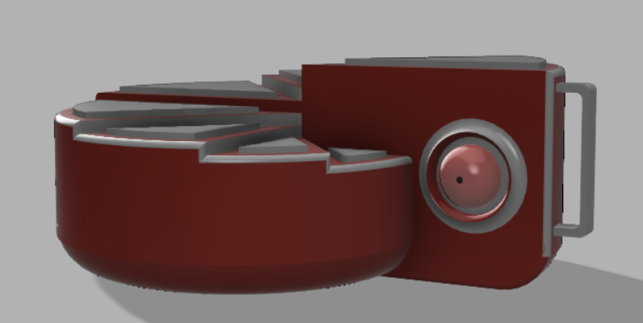

I have two versions for my project which is called Caring to fall apart: one is only a render but it's my latest version, the other is the one that I could impressed in 3D (short time) but it's not the latest version.

Impressed version:

Render latest version:

