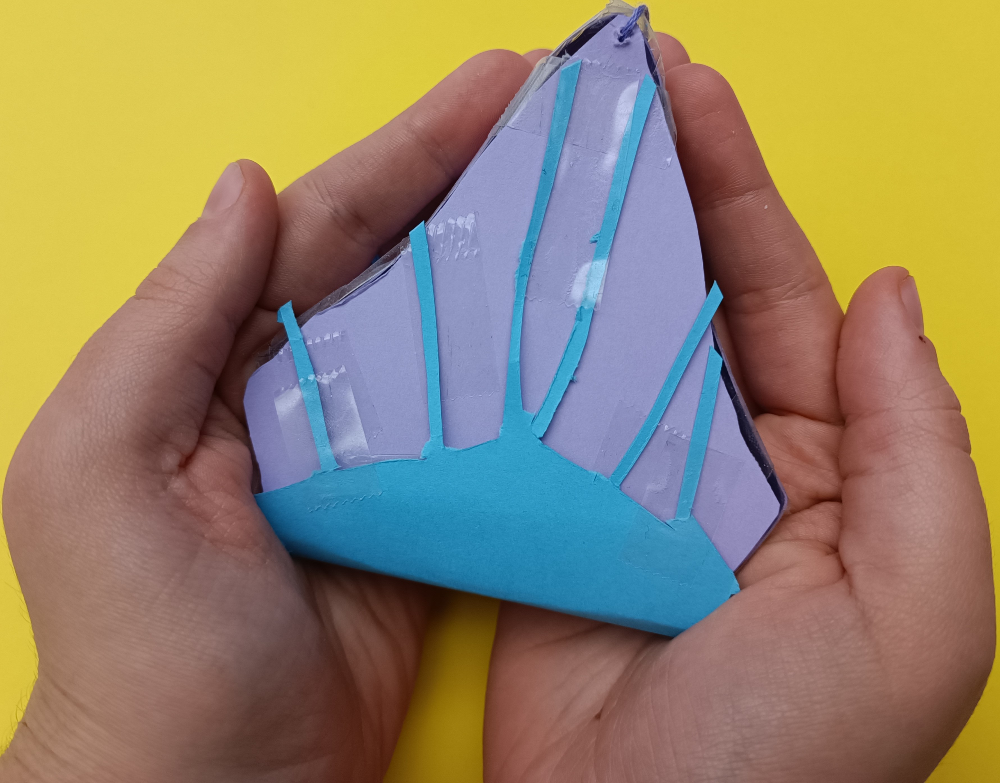

## Recherches internets

J'ai recherché diverses matières (silicones, squishy etc) sur internet, pinterest etc. J'ai également porté de l'intérêt à la bimatière.

## Tests objects

J'ai testé des formes d'ammonites, en pâte des rêves et en papier. La forme ne fit pas assez bien entre les mains, trop grosse. (05/12/2022)

J'ai aujourd'hui essayé avec une autre forme, celle d'une dent de requin pour mieux fonctionner entre mes mains (que la forme épouse mieux leurs creux).

Je pense créer une forme bimatière, silicone semblable à celui d'une wiimote mais également une forme plus dure en dessous (matière bleu serait le silicone et le violet la forme plus solide).

