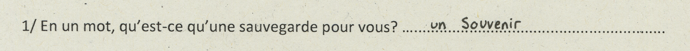

# The countdown of the (h)and

I was able to observe through my questionnaires, that the backup had allowed us to lengthen our tracks and to make them more complex in addition to having them always with us. If it were to disappear, the hand, writing and language would once again become the main means of letting the memory impose itself in time.

If the backup no longer existed, we would still have the hand to write or draw, but if the trace left by the hand disappeared like the footprints in the sand by the sea, what would be left?

