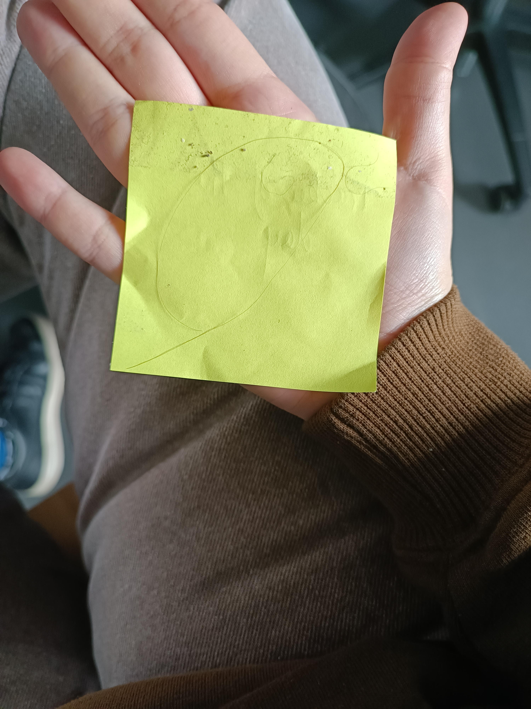

# rewrite pitch

My investigations consisted of observing a traffic circle, following the day of a post-it and interviews about our impact in time. I was able to note that ways to leave traces other than pictorial or handwritten were possible.

The post-it note took dust and dirt, car headlights reflected in the glass and I was often told that being in contact with people was already a trace.

In a system where pictorial memory would be unavailable, can we imagine touch (like a hug) as a viable and lasting way to keep us in memory?

